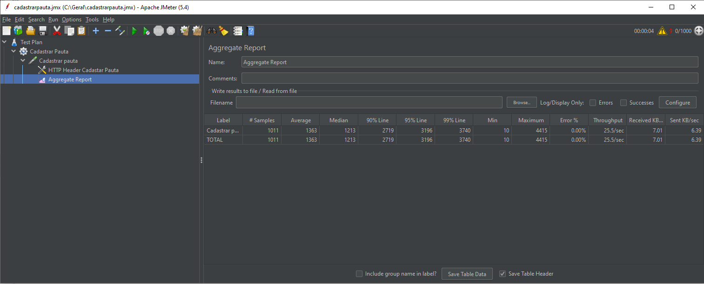

# Gestão de pautas

Criação de um conjunto de APIs REST para realização de votação de pautas.

Segue objetivo do desafio:

No cooperativismo, cada associado possui um voto e as decisões são tomadas em assembleias, por votação. Imagine que você deve criar uma solução backend para gerenciar essas sessões de votação.

Essa solução deve ser executada na nuvem e promover as seguintes funcionalidades através de uma API REST:

* Cadastrar uma nova pauta
* Abrir uma sessão de votação em uma pauta (a sessão de votação deve ficar aberta por um tempo determinado na chamada de abertura ou 1 minuto por default)
* Receber votos dos associados em pautas (os votos são apenas 'Sim'/'Não'. Cada associado é identificado por um id único e pode votar apenas uma vez por pauta)
* Contabilizar os votos e dar o resultado da votação na pauta

###São consideradas tarefas bônus
####1. Integração com sistemas externos
+ Integrar com um sistema que verifique, a partir do CPF do associado, se ele pode votar.
	+ GET https://user-info.herokuapp.com/users/{cpf}.
	+ Caso o CPF seja inválido, a API retornará o HTTP Status 404 (Not found). Você pode usar geradores de CPF para gerar CPFs válidos.
	+ Caso o CPF seja válido, a API retornará se o usuário pode (ABLE_TO_VOTE) ou não pode (UNABLE_TO_VOTE) executar a operação.

Exemplos de retorno do serviço
```
{
	"status": "ABLE_TO_VOTE"
}
```
#####Resolução:
Foi implementada uma classe chamada **ValidaCpfServiceImpl** que realiza a comunicação da aplicação com o sistema externo retornando um enumeration com o status **ABLE_TO_VOTE** ou **UNABLE_TO_VOTE**.
####2. Mensageria e filas
* O resultado da votação precisa ser informado para o restante da plataforma, isso deve ser feito preferencialmente através de mensageria. Quando a sessão de votação fechar, poste uma mensagem com o resultado da votação.

#####Resolução:
Consegui implementar o producer quando é realizado um voto, mas infelizmente não consegui realizar o consumer a tempo.
                    
####3. Performance
* Imagine que sua aplicação possa ser usada em cenários que existam centenas de milhares de votos. Ela deve se comportar de maneira performática nesses cenários.
* Testes de performance são uma boa maneira de garantir e observar como sua aplicação se comporta.

#####Resolução:
Realizei o teste de performance utilizando a ferramenta Apache JMeter.


####4. Versionamento da API
* Como você versionaria a API da sua aplicação? Que estratégia usar?

#####Resolução:
Das maneiras que estudei, existem duas que me parecem ser as melhores.
1. No caminho da URL – é adicionado um valor (exemplo: “v1”) na URL do endpoint. Exemplo completo: http://localhost:8080/v1/buscarCooperado/13
2.  Adiciona um header personalizado – Mandar no header da requisição a versão da API que você está querendo consultar.
	* Exemplo:
		* URL - http://localhost:8080/buscarCooperado/13
		* Header - versionApi: v1

##Recursos utilizados
* Java 8
* Spring Boot
* Maven
* MySQL
* Swagger
* Apache JMeter

##Requisitos da aplicação
* Java 8
* MySQL

##Configurar e rodar a aplicação
* Após baixar o projeto, descompactá-lo em uma pasta e abri-lo no Eclipse.
* Na raiz do projeto existe o arquivo ScriptCriacaoDB.txt. Nele tem todos os scripts necessários para a criação do banco de dados e suas respectivas tabelas.

##Acesso as APIs da Aplicação
Depois que a aplicação estiver em funcionamento, o acesso as APIs estarão disponíveis pela URL base http://localhost:8085/gestaopauta/

Todo o teste pode ser realizado através da ferramenta Swagger pelo link: http://localhost:8085/swagger-ui.html